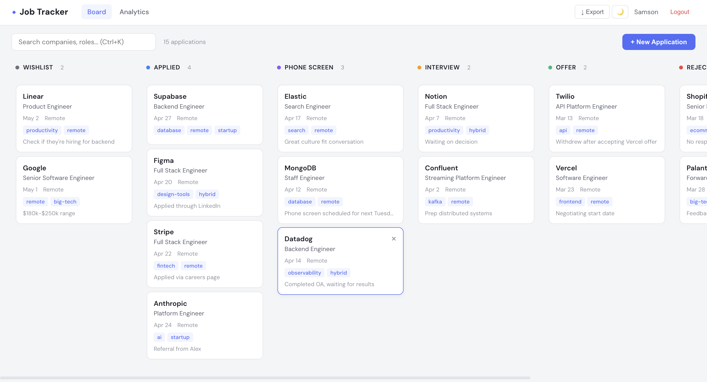
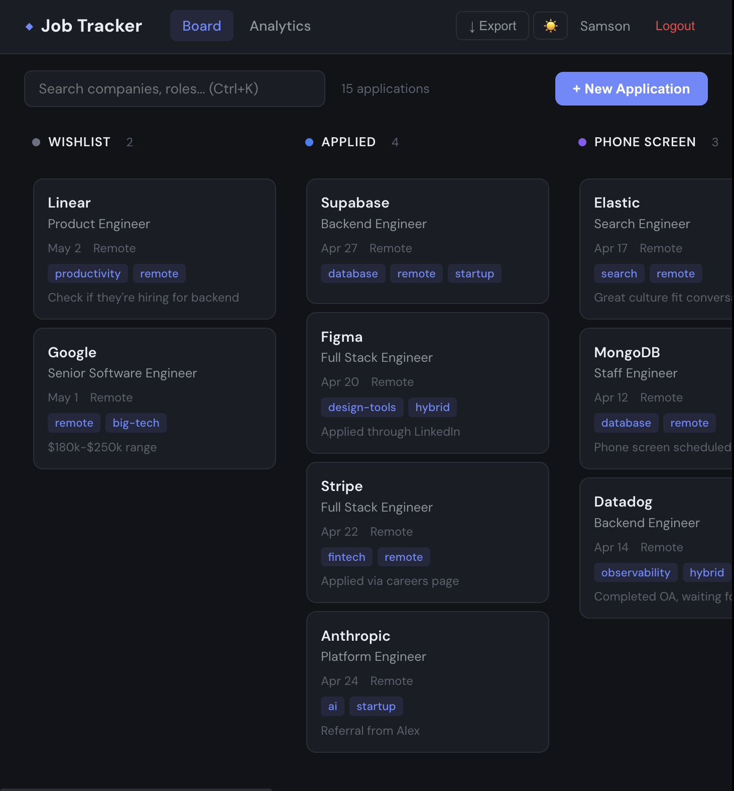
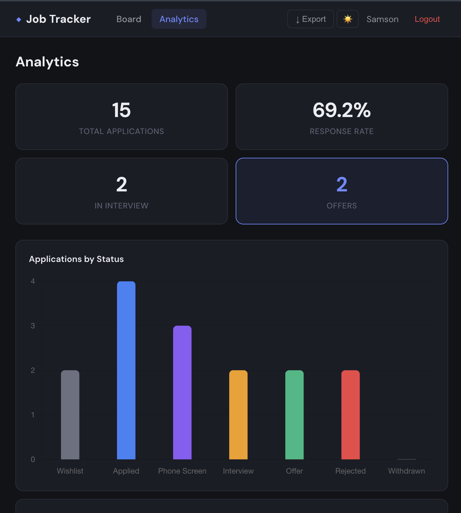
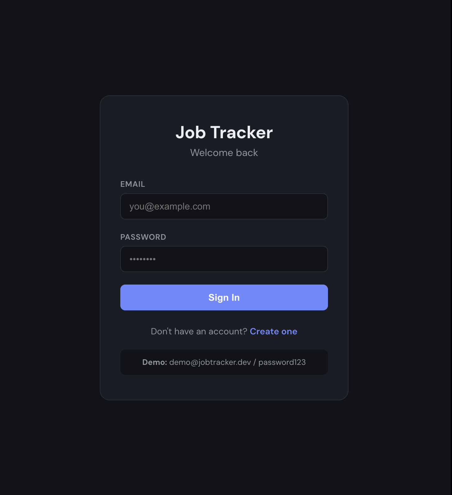

# ◆ Job Tracker Dashboard

A full-stack job application tracker with a Kanban board, analytics dashboard, and contact management — built for developers who want to stay organized during the job hunt.

![Kanban Board Demo]

## Features

- **Kanban Board** — Drag-and-drop cards between status columns (Wishlist → Applied → Interview → Offer)
- **Full CRUD** — Create, edit, delete applications with contacts, notes, and tags
- **Search & Filter** — Real-time search across companies, roles, and tags (Ctrl+K shortcut)
- **Analytics Dashboard** — Charts for application volume, status breakdown, response rate, and top tags
- **CSV Export** — Download all applications as a spreadsheet in one click
- **Activity Timeline** — Audit log tracking every change per application
- **Dark Mode** — Toggle between light and dark themes with persistence
- **JWT Auth** — Secure token-based authentication with bcrypt password hashing
- **Docker** — One-command setup with docker-compose
- **CI/CD** — GitHub Actions pipeline running integration tests on every push

## Screenshots

<table>
  <tr>
    <td></td>
    <td></td>
  </tr>
  <tr>
    <td align="center"><em>Kanban Board — Light Mode</em></td>
    <td align="center"><em>Kanban Board — Dark Mode</em></td>
  </tr>
  <tr>
    <td></td>
    <td></td>
  </tr>
  <tr>
    <td align="center"><em>Analytics Dashboard</em></td>
    <td align="center"><em>Login Page</em></td>
  </tr>
</table>

## Tech Stack


## Quick Start

### Option A: Docker (recommended)

```bash
git clone https://github.com/Samsxn243/job-tracker-dashboard.git
cd job-tracker-dashboard
docker-compose up --build
```

### Option B: Manual

**Prerequisites:** Java 17+ · Maven 3.9+ · Node 18+ · MongoDB (local or Atlas free tier)

```bash
# Terminal 1 — Backend
cd backend
mvn spring-boot:run

# Terminal 2 — Frontend
cd frontend
npm install
ng serve
```

Open `http://localhost:4200`

### Demo credentials

The seeder auto-creates a demo account with 15 sample applications:

```
Email:    demo@jobtracker.dev
Password: password123
```

## Architecture

```
┌─────────────────────────────────────────────────┐
│            Angular 17 Frontend                  │
│  Kanban Board · Analytics · Forms · Dark Mode   │
│  CDK Drag-Drop · Chart.js · JWT Interceptor     │
└────────────────────┬────────────────────────────┘
                     │ REST / JSON
┌────────────────────▼────────────────────────────┐
│           Spring Boot 3 API                     │
│  Controllers → Services → Repositories          │
│  JWT Auth · CORS · Global Exception Handler     │
└────────────────────┬────────────────────────────┘
                     │ Spring Data MongoDB
┌────────────────────▼────────────────────────────┐
│              MongoDB Atlas                      │
│  applications · users · activity_logs           │
└─────────────────────────────────────────────────┘
```

## API Reference

### Auth

| Method | Endpoint             | Description     |
|--------|----------------------|-----------------|
| POST   | `/api/auth/register` | Create account  |
| POST   | `/api/auth/login`    | Get JWT token   |

### Applications

All endpoints require `Authorization: Bearer <token>` header.

| Method | Endpoint                        | Description                          |
|--------|---------------------------------|--------------------------------------|
| GET    | `/api/applications`             | List all (query: status, tag, search, from, to) |
| GET    | `/api/applications/:id`         | Get single application               |
| POST   | `/api/applications`             | Create application                   |
| PUT    | `/api/applications/:id`         | Full update                          |
| PATCH  | `/api/applications/:id/status`  | Update status (Kanban drag-drop)     |
| DELETE | `/api/applications/:id`         | Delete application                   |
| GET    | `/api/applications/:id/timeline`| Activity log for this application    |
| GET    | `/api/applications/export/csv`  | Download all as CSV                  |

### Analytics

| Method | Endpoint                 | Description                              |
|--------|--------------------------|------------------------------------------|
| GET    | `/api/analytics/summary` | Stats: by status, by week, response rate |

## API Usage Examples

```bash
# Login
curl -X POST http://localhost:8080/api/auth/login \
  -H "Content-Type: application/json" \
  -d '{"email": "demo@jobtracker.dev", "password": "password123"}'

# Create an application
curl -X POST http://localhost:8080/api/applications \
  -H "Authorization: Bearer YOUR_TOKEN" \
  -H "Content-Type: application/json" \
  -d '{"company": "Stripe", "role": "Backend Engineer", "status": "APPLIED", "tags": ["fintech"]}'

# Kanban move (drag-drop)
curl -X PATCH http://localhost:8080/api/applications/APP_ID/status \
  -H "Authorization: Bearer YOUR_TOKEN" \
  -H "Content-Type: application/json" \
  -d '{"status": "INTERVIEW"}'

# Analytics
curl http://localhost:8080/api/analytics/summary \
  -H "Authorization: Bearer YOUR_TOKEN"

# Export CSV
curl http://localhost:8080/api/applications/export/csv \
  -H "Authorization: Bearer YOUR_TOKEN" -o applications.csv
```

## Project Structure

```
job-tracker-dashboard/
├── backend/
│   ├── src/main/java/com/tracker/
│   │   ├── controller/    AuthController, ApplicationController, AnalyticsController
│   │   ├── service/       ApplicationService, AnalyticsService
│   │   ├── repository/    ApplicationRepository, UserRepository, ActivityLogRepository
│   │   ├── model/         Application, User, ActivityLog, Contact, ApplicationStatus
│   │   ├── dto/           ApplicationDTO, StatusUpdateDTO, AuthDTO, AnalyticsSummaryDTO
│   │   ├── config/        SecurityConfig, CorsConfig, JwtUtil, JwtAuthFilter, DataSeeder
│   │   └── exception/     GlobalExceptionHandler, ResourceNotFoundException
│   ├── src/test/java/     20 integration tests (Auth, Application CRUD, Analytics)
│   ├── Dockerfile
│   └── pom.xml
├── frontend/
│   ├── src/app/
│   │   ├── components/    kanban-board, app-card, app-form, analytics, login, navbar
│   │   ├── services/      auth.service, application.service
│   │   ├── models/        application.model (interfaces, enums, constants)
│   │   ├── guards/        auth.guard
│   │   └── interceptors/  jwt.interceptor
│   └── package.json
├── docs/                   Screenshots
├── docker-compose.yml
├── .github/workflows/ci.yml
└── .gitignore
```

## Testing

```bash
cd backend
mvn test
```

Runs 20 integration tests covering auth flows, CRUD operations, Kanban status updates, analytics computation, user data isolation, and validation.

## License

MIT
